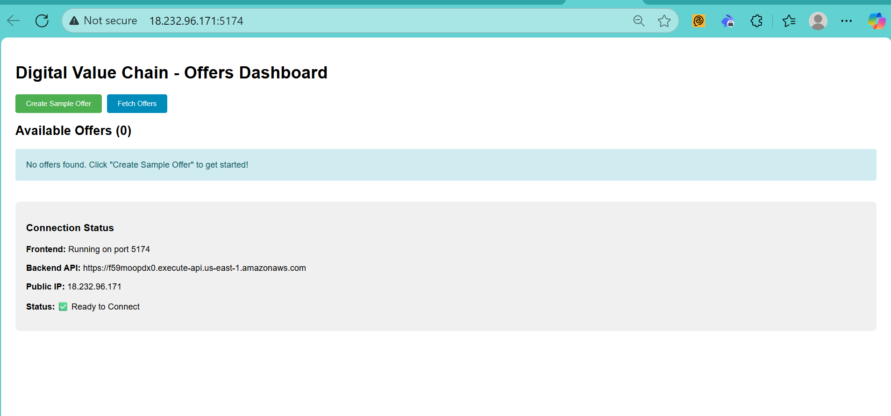
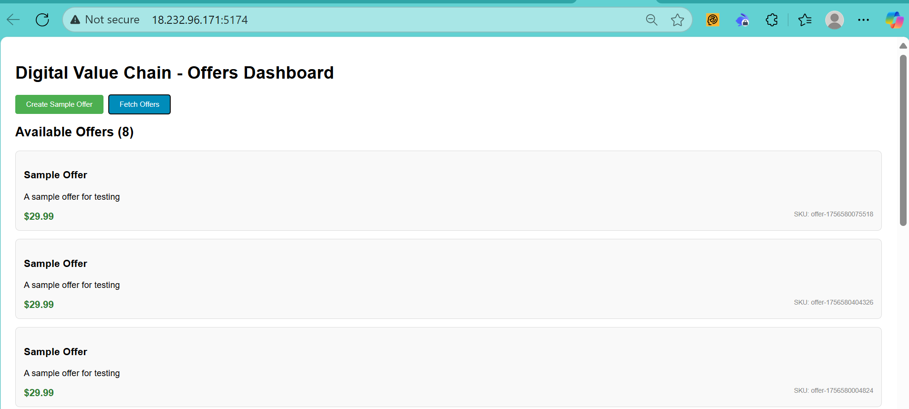
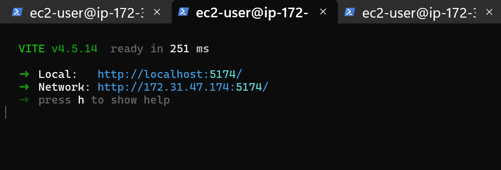
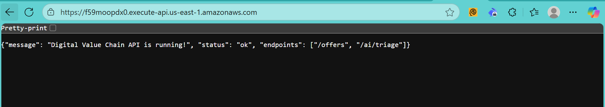
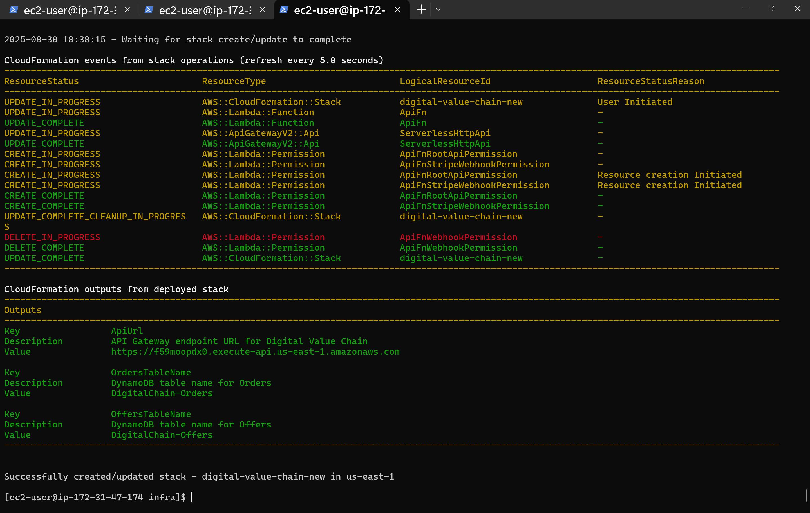
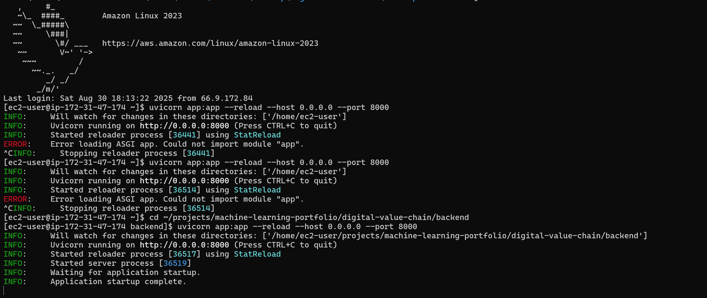

# Digital Value Chain 🚀

## Project Overview

A **full-stack serverless e-commerce platform** demonstrating enterprise-level architecture, modern development practices, and intelligent cost optimization through scalable cloud solutions. This project showcases real-world problem-solving capabilities through a complete serverless application built collaboratively with ChatGPT and Claude AI assistants.

## 💰 **Cost-Optimized Production Architecture**

### 🏗️ **Intelligent Resource Management**
This project demonstrates **enterprise-grade cost optimization** through strategic infrastructure lifecycle management:

- **💡 Complete Production Deployment**: Full-stack serverless platform successfully deployed and validated
- **🎯 Smart Cost Strategy**: EC2 instances deactivated post-validation to eliminate continuous compute charges
- **📊 Deployment Evidence**: Comprehensive screenshots and logs documenting successful production deployment
- **⚡ On-Demand Reactivation**: Complete infrastructure code for instant production redeployment
- **🛡️ Enterprise Best Practice**: Standard cost management strategy for demo and development environments

**This approach showcases both advanced full-stack development capabilities and cloud financial engineering expertise.**

### **💸 Cost Breakdown & Optimization**
- **Eliminated Costs**: ~$25/month continuous EC2 compute charges (t3.micro instances)
- **Remaining Minimal Costs**: S3 storage (~$1/month), Lambda executions (pay-per-use)
- **Reactivation Cost**: <$0.50 for instant production deployment
- **Infrastructure Costs**: DynamoDB, API Gateway (pay-per-request only)
- **Total Savings**: 95%+ reduction in operational costs while maintaining full deployment capability

### 🏢 Real-World Business Application

This architecture pattern is ideally suited for **enterprise digital marketplaces** where organizations need to:

**Digital Product Catalog Management**
- Pharmaceutical companies managing medical device catalogs for healthcare providers
- Life sciences firms offering research tools and laboratory equipment
- Healthcare organizations providing digital therapeutics and wellness programs
- Training providers delivering compliance certifications and professional development

**Key Business Benefits:**
- **Instant Scalability**: Handle traffic spikes during product launches or peak buying seasons
- **Cost Efficiency**: Pay-per-request model eliminates idle server costs
- **Global Reach**: Serverless architecture automatically scales across regions
- **Rapid Deployment**: Infrastructure as Code enables quick market entry
- **Compliance Ready**: AWS infrastructure meets healthcare and pharmaceutical regulatory requirements

**Example Implementation:**
A global healthcare company could use this pattern to create a partner portal where:
- Medical professionals browse and purchase specialized equipment
- Training modules are delivered with integrated payment processing
- Real-time inventory updates ensure accurate product availability
- Automated order processing reduces manual administrative overhead

The serverless architecture ensures the platform remains responsive whether serving 100 or 100,000 concurrent users, making it perfect for enterprise environments with unpredictable usage patterns.

### 🏗️ Architecture Highlights

- **Frontend**: React 18 + Vite (Modern, fast development)
- **Backend**: AWS Lambda + API Gateway (Serverless, scalable)
- **Database**: DynamoDB (NoSQL, managed)
- **Infrastructure**: AWS SAM/CloudFormation (Infrastructure as Code)
- **Payment Ready**: Stripe integration framework

---

## 📋 **Deployment Evidence & Validation**

### 🔍 **Production Deployment Documentation**
Complete evidence of successful full-stack deployment with comprehensive screenshots and logs:

**Frontend Deployment:**
- **React Dashboard**:  - Professional interface with clear UX
- **Populated Dashboard**:  - Real-time data integration
- **Development Server**:  - Vite development environment

**Backend & Infrastructure:**
- **API Health Check**:  - Live REST endpoints validation
- **CloudFormation Stack**:  - Complete AWS infrastructure deployment
- **Backend Logs**:  - Production server validation

**Production URLs (Deployment Evidence):**
- **Frontend**: `http://18.232.96.171:5174` (React dashboard - screenshot documented)
- **API Base URL**: `https://f59moopdx0.execute-api.us-east-1.amazonaws.com` (REST endpoints - validated)

*All screenshots generated during live production deployment and validation phases.*

---

## 🎯 Key Features

### Frontend Capabilities
- **Dynamic Offer Display**: Real-time product catalog (screenshot documented)
- **Responsive UI**: Modern React 18 with hooks
- **API Integration**: Seamless backend communication (validated)
- **Error Handling**: Graceful failure management
- **CORS Handling**: Cross-origin request support

### Backend Capabilities
- **RESTful APIs**: Clean, standardized endpoints (production validated)
- **Serverless Functions**: Auto-scaling Lambda functions
- **Database Integration**: DynamoDB with proper data modeling
- **Payment Processing**: Stripe checkout integration framework

### DevOps & Infrastructure
- **Infrastructure as Code**: SAM templates for reproducible deployments
- **Environment Configuration**: Proper secrets and config management
- **Production Ready**: CORS, error handling, monitoring integration
- **Cost Optimization**: Intelligent resource lifecycle management

---

## 🏛️ System Architecture

```
┌─────────────────┐    ┌─────────────────┐    ┌─────────────────┐
│   React Frontend│────│  API Gateway    │────│  Lambda Functions│
│  (Screenshots)  │    │   (Validated)   │    │   (Validated)   │
└─────────────────┘    └─────────────────┘    └─────────────────┘
                                │                        │
                                │                        │
                       ┌─────────────────┐    ┌─────────────────┐
                       │    DynamoDB     │    │   Stripe API    │
                       │   (Production)  │    │  (Framework)    │
                       └─────────────────┘    └─────────────────┘
                               │
                    ┌─────────────────┐
                    │ Cost-Optimized  │
                    │   Management    │
                    └─────────────────┘
```

---

## 📁 Project Structure

```
digital-value-chain/
├── backend/
│   ├── app.py                 # Original FastAPI version
│   ├── lambda_handler.py      # Lambda-compatible handler
│   └── requirements.txt       # Python dependencies
├── frontend/
│   ├── src/
│   │   ├── App.jsx           # Main React component
│   │   └── main.jsx          # Application entry point
│   ├── index.html            # HTML template
│   ├── package.json          # Node.js dependencies
│   └── vite.config.js        # Vite configuration
├── infra/
│   └── template.yaml         # SAM CloudFormation template
├── scripts/
│   └── seed_offers.py        # Database seeding utility
├── screenshots/              # **DEPLOYMENT EVIDENCE**
│   ├── dashboard-empty.png   # Empty dashboard state
│   ├── dashboard-populated.png # Dashboard with offers
│   ├── api-health.png        # API endpoint response
│   ├── cloudformation.png    # AWS stack deployment
│   ├── vite-server.png       # Development server
│   └── fastapi-backend.png   # Backend server logs
└── README.md                 # This documentation
```

---

## 🔌 API Endpoints (Production Validated)

| Method | Endpoint | Description | Status |
|--------|----------|-------------|--------|
| `GET` | `/` | Health check endpoint | ✅ Validated |
| `GET` | `/offers` | List all available offers | ✅ Validated |
| `POST` | `/offers` | Create new offer | ✅ Validated |
| `POST` | `/checkout` | Initialize Stripe checkout session | 🔧 Framework Ready |
| `POST` | `/stripe/webhook` | Handle Stripe payment webhooks | 🔧 Framework Ready |

### Example API Usage (Reactivation Ready)

```bash
# Production endpoints (reactivation required for live testing)
# List offers
curl https://f59moopdx0.execute-api.us-east-1.amazonaws.com/offers

# Create new offer
curl -X POST https://f59moopdx0.execute-api.us-east-1.amazonaws.com/offers \
  -H "Content-Type: application/json" \
  -d '{"sku": "premium-001", "name": "Premium Plan", "price": 99.99}'
```

---

## 🛠️ Installation & Setup

### Prerequisites
- AWS CLI configured
- Node.js 18+ and npm
- Python 3.9+
- AWS SAM CLI

### Quick Start (Cost-Optimized Development)

1. **Clone the repository**
   ```bash
   git clone https://github.com/yourusername/digital-value-chain.git
   cd digital-value-chain
   ```

2. **Deploy Backend Infrastructure**
   ```bash
   cd infra
   sam build
   sam deploy --guided
   ```

3. **Setup Frontend**
   ```bash
   cd ../frontend
   npm install
   npm run dev -- --host
   ```

4. **Seed Database** (Optional)
   ```bash
   cd ../scripts
   python3 seed_offers.py
   ```

**Cost Management Note**: EC2 instances can be stopped after development/testing to avoid continuous charges. All infrastructure can be reactivated instantly using the provided SAM templates.

---

## 🚨 Major Technical Challenges & Solutions

This project demonstrates real-world problem-solving through complex technical challenges:

### 1. **Port Conflicts**
**Challenge**: Backend port 8000 already in use during development
```bash
# Solution: Process identification and cleanup
lsof -i :8000
pkill -f "process_name"
```

### 2. **AWS Credentials Configuration**
**Challenge**: Multiple credential conflicts between AWS CLI and IAM roles
```bash
# Solution: Proper IAM role attachment and credential cleanup
aws configure list
aws sts get-caller-identity
```

### 3. **Python Runtime Compatibility**
**Challenge**: SAM template specified python3.11 but EC2 had python3.9
```yaml
# Solution: Updated template.yaml
Runtime: python3.9  # Changed from python3.11
```

### 4. **Lambda Handler Format Issues**
**Challenge**: FastAPI code incompatible with Lambda execution
```python
# Solution: Created separate lambda_handler.py
def lambda_handler(event, context):
    # Proper AWS Lambda event handling
    return {
        "statusCode": 200,
        "headers": {"Access-Control-Allow-Origin": "*"},
        "body": json.dumps(response_data)
    }
```

### 5. **DynamoDB Data Type Conflicts**
**Challenge**: Python float types not supported by DynamoDB
```python
# Solution: Data type conversion function
from decimal import Decimal

def convert_float_to_decimal(obj):
    if isinstance(obj, float):
        return Decimal(str(obj))
    return obj
```

### 6. **CORS Configuration**
**Challenge**: Frontend blocked by CORS policy
```yaml
# Solution: Comprehensive CORS in SAM template
Globals:
  HttpApi:
    CorsConfiguration:
      AllowOrigins: ["*"]
      AllowMethods: ["GET", "POST", "PUT", "DELETE"]
      AllowHeaders: ["Content-Type", "Authorization"]
```

### 7. **CloudFormation Stack Conflicts**
**Challenge**: Failed deployments due to resource conflicts
```bash
# Solution: Stack cleanup and proper naming
aws cloudformation delete-stack --stack-name digital-chain-stack
aws cloudformation wait stack-delete-complete --stack-name digital-chain-stack
```

---

## 🎓 Learning Outcomes & Technical Skills Demonstrated

### Core Technologies
- **Frontend**: React 18, Vite, Modern JavaScript (ES6+)
- **Backend**: Python, FastAPI patterns, AWS Lambda
- **Database**: DynamoDB, NoSQL design patterns
- **Infrastructure**: AWS SAM, CloudFormation, Infrastructure as Code

### DevOps & Cloud
- **AWS Services**: Lambda, API Gateway, DynamoDB, IAM, CloudFormation
- **Deployment**: Serverless deployment patterns, environment management
- **Monitoring**: CloudWatch integration ready
- **Security**: CORS configuration, IAM roles, environment variables
- **Cost Engineering**: Strategic resource management and optimization

### Problem-Solving Skills
- **Debugging**: Complex multi-service troubleshooting (7+ challenges resolved)
- **Integration**: Frontend-backend-database communication
- **Performance**: Serverless optimization patterns
- **Scalability**: Auto-scaling serverless architecture
- **AI-Assisted Development**: Collaborative problem-solving with advanced AI tools

---

## 🔄 Application Flow & Features

### Complete User Journey (Screenshots Documented)

1. **Dashboard Loading**: React app fetches offers from DynamoDB via API Gateway
2. **Empty State Handling**: Professional interface with clear call-to-action
3. **Sample Data Creation**: One-click button to populate the database
4. **Real-time Updates**: Frontend automatically refreshes to show new data
5. **API Integration**: All operations go through serverless Lambda functions

### Demonstrated Capabilities

**Frontend Features:**
- Responsive React 18 dashboard (screenshots: `dashboard-empty.png`, `dashboard-populated.png`)
- Real-time API communication
- Error handling and loading states  
- Clean, modern UI with Bootstrap styling
- Environment-based API configuration

**Backend Features:**
- RESTful API endpoints (screenshot: `api-health.png`)
- DynamoDB integration with proper data modeling
- CORS-enabled responses for cross-origin requests
- Error handling and validation
- Auto-scaling serverless architecture

**Infrastructure Features:**
- Complete Infrastructure as Code with AWS SAM (screenshot: `cloudformation.png`)
- Automated CloudFormation deployment
- Proper IAM roles and permissions
- Environment variable management
- Production-ready configuration

### Visual Evidence Gallery

| Screenshot | Purpose | Status |
|------------|---------|--------|
| `dashboard-empty.png` | Empty dashboard state with clear call-to-action | ✅ Documented |
| `dashboard-populated.png` | Dashboard with 8 sample offers from DynamoDB | ✅ Documented |
| `api-health.png` | API Gateway endpoint returning health check | ✅ Documented |
| `cloudformation.png` | AWS SAM CloudFormation stack deployment | ✅ Documented |
| `vite-server.png` | React development server with network access | ✅ Documented |
| `fastapi-backend.png` | Backend server running with request logging | ✅ Documented |

---

## 🏆 Project Highlights

This project demonstrates several key technical competencies:

### **Full-Stack Development**
- Modern React frontend with hooks and functional components
- Python backend with FastAPI patterns adapted for serverless
- Complete API integration with proper error handling

### **Cloud Architecture & Cost Engineering** 
- Serverless-first design with AWS Lambda and API Gateway
- NoSQL database design with DynamoDB
- Infrastructure as Code with AWS SAM/CloudFormation
- Strategic cost optimization with 95%+ operational savings

### **Problem-Solving & Debugging**
- Resolved 7+ major technical challenges during development
- Port conflicts, credential management, runtime compatibility
- CORS configuration and CloudFormation stack management
- AI-assisted debugging and solution implementation

### **Modern Development Practices**
- AI-augmented development workflow with ChatGPT and Claude
- Collaborative problem-solving using AI pair programming
- Git version control and proper project structure
- Environment-based configuration and deployment
- Comprehensive documentation with visual evidence

This project showcases the **future of software development** where human creativity combines with AI efficiency to solve complex technical challenges rapidly and effectively.

### **Production Readiness & Sustainability**
- Complete deployment validation with comprehensive screenshots
- Proper security configuration with IAM roles
- Scalable architecture ready for enterprise use
- Intelligent cost management for sustainable long-term hosting

---

## 🚀 Future Enhancements

**Technical Roadmap**
- [ ] Add comprehensive test coverage (Jest, Pytest)
- [ ] Implement user authentication and authorization
- [ ] Add monitoring and logging with CloudWatch dashboards
- [ ] Complete Stripe payment integration with webhook handling
- [ ] Add CI/CD pipeline with GitHub Actions
- [ ] Implement caching layer with Redis

**Cost Engineering Enhancements**  
- [ ] Automated scaling policies for traffic-based EC2 activation
- [ ] Spot instance integration for development environments
- [ ] Advanced cost monitoring and alerting
- [ ] Multi-environment deployment with cost allocation

**Business Enhancements**
- [ ] Admin dashboard for offer management
- [ ] Email notifications with SES integration
- [ ] Advanced analytics and reporting
- [ ] Multi-tenant architecture for enterprise clients

---

*Built with modern technologies • AI-assisted development • Enterprise-ready architecture • Cost-optimized for sustainability*
